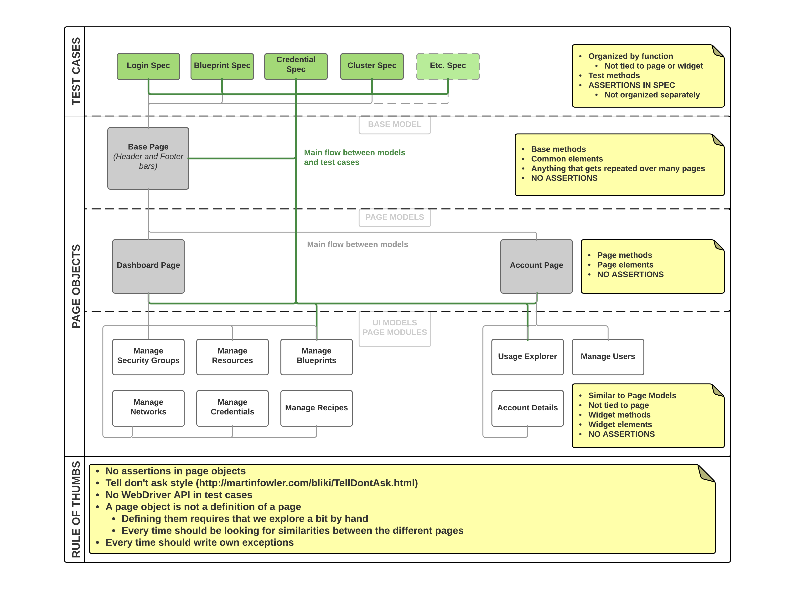

# ULUWATU functional E2E tests (Protractor, Jasmine)

## Description
Cloudbreak web application functional smoke test project.

## Technology stack
- [Protractor](https://angular.github.io/protractor/#/)
  - [WebDriverJS](http://webdriver.io/)
      - [WebDriver's JavaScript API](https://github.com/SeleniumHQ/selenium/wiki/WebDriverJs)
      - ..."WebDriver's JavaScript API is entirely asynchronous and every command results in a promise. Promise-heavy APIs will be a lot easier to work with"..."Implicitly synchronizes asynchronous actions, making it so you only have to register a promise callback when you want to catch an error or access a return value."...
  - [NodeJS](https://nodejs.org/api/)
- [Jasmine](http://jasmine.github.io/)
- [Jasmine Allure Reporter](https://www.npmjs.com/package/jasmine-allure-reporter)

## Prerequisites
The following environment variables should be present for you with valid values:

- BASE_URL
- USERNAME
- PASSWORD
- SSHKEY

### AWS
- AWS_ROLE_ARN

### OpenStack
- OS_AUTH_URL
- OS_TENANT_NAME
- OS_PASSWORD
- OS_USERNAME
- OS_VIRTUAL_NETWORK_ID
- OS_SUBNET_ID

> For OS X Yosemite users with IntelliJ IDEA: You should add the required environment variables to your
`bash_profile` to can run tests directly form IDEA with no issues.
The file should contain the variables as:
```
export BASE_URL=your.url
launchctl setenv BASE_URL $BASE_URL
export USERNAME=your@mail.address
launchctl setenv USERNAME $USERNAME
export PASSWORD=your.password
launchctl setenv PASSWORD $PASSWORD
export AWS_ROLE_ARN=arn:aws:iam::1234567890:role/rolename
launchctl setenv AWS_ROLE_ARN $AWS_ROLE_ARN
export SSHKEY=AGab6CB4MUzsqF7vGTF/XU5pYXFUBhi8xzey+37QCKp3+mCqjFzPyQQmIVWpofpjT7BfcCxH877RzC5YMIi65aBc82Dl6tH6OEiP7
launchctl setenv SSHKEY $SSHKEY
```
Please do not forget you should reopen your project and restart your IDEA.

## Executing tests
If your Protractor test environment has not cloned and set up yet, you should install every needed packages and tools first. Please check the [Protractor Tutorial](https://angular.github.io/protractor/#/tutorial).

The easiest way to get all the needed Node packages in one round to use `npm install` after you have cloned this repository for your drive. Please check the [npm-install](https://docs.npmjs.com/cli/install) documentation.

You do not need to launch the `webdriver-manager` for these tests, because of the `directConnect` is `true` in the [Protractor configuration](https://github.com/sequenceiq/uluwatu-e2e-protractor/blob/master/e2e.conf.js#L76). In this case the Protractor works directly with Chrome Driver or Firefox Driver, bypassing any Selenium Server.

Execute the tests based on the configuration:
```
protractor e2e.conf.js
```
## Structure


### Introduction to Page Object Pattern
You can check all the needed information on the [Page Object Pattern page](/pages/PAGEOBJECTPATTERN.md)

# Docker image for ULUWATU functional E2E test project

**Docker image for executing headless Google Chrome or Firefox Protractor e2e test cases in Docker container is available at DockerHub as [hortonworks/docker-e2e-protracto](https://hub.docker.com/r/hortonworks/docker-e2e-protractor/)**

## To run ULUWATU tests in this container

1. Clone this repository in a local folder then open it.
2. Provide valid and appropriate values for base test parameters in the [environment file](utils/testenv). The following variables should be set:
     - BASE_URL=`https://pre-prod-accounts.sequenceiq.com/`
     - USERNAME=`testing@something.com`
     - PASSWORD=`password`
     - AWS_ROLE_ARN=`arn:aws:iam::1234567890:role/userrole`
     - SSHKEY=`AAAAB3NzaC1+soon...etc.`
     - OS_AUTH_URL=`http://123.12.0.12:5000/v2.0`
     - OS_TENANT_NAME=`sequenceiq`
     - OS_PASSWORD=`sequenceiq`
     - OS_USERNAME=`sequenceiq`
     - OS_VIRTUAL_NETWORK_ID=`a1ad2a3d-d1a2-1230-1d23-12a34f5fb678`
     - OS_SUBNET_ID=`0404bf21-db5f-4987-8576-e65a4a99b14e`
3. Pull the [hortonworks/docker-e2e-protractor](https://hub.docker.com/r/hortonworks/docker-e2e-protractor/) image from DockerHub
4. Execute the Protractor test configuration for ULUWATU in [Docker container](https://docs.docker.com/engine/installation/):
    ```
    docker run -it --rm --name uluwatu-e2e-runner --env-file utils/testenv -v $(PWD):/protractor/project hortonworks/docker-e2e-protractor e2e.conf.js --suite smoke
    docker run -it --rm --name uluwatu-e2e-runner -e BASE_URL=$(BASE_URL) -e USERNAME=$(USERNAME) -e PASSWORD=$(PASSWORD) -e AWS_ROLE_ARN=$(PASSWORD) -e SSHKEY=$(SSHKEY) -v $(PWD):/protractor/project hortonworks/docker-e2e-protractor e2e.conf.js --suite regression
    ```

     - `uluwatu-e2e-runner` name of the new Docker container (created from `sequenceiq/protractor-runner` Docker image)
     - `utils/testenv` the location (full path) of the `testenv` file on your machine
     - `USERNAME` a single environment variable that is passed for the new container
     - `$(PWD)` or `pwd` the root folder of your Protractor test project
        - For example the local folder where the [ULUWATU functional E2E tests](https://github.com/sequenceiq/uluwatu-e2e-protractor) project has been cloned from GitHub.
        - The use of **PWD is optional**, you do not need to navigate to the Protractor test project root. If it is the case, you should add the full path of the root folder instead of the `$(PWD)`.
     - `e2e.conf.js --suite regression` in case of regression testing

## Advanced options

### Protractor direct connect
Protractor can test directly using Chrome Driver or Firefox Driver, [bypassing any Selenium Server](https://github.com/angular/protractor/blob/master/docs/server-setup.md#connecting-directly-to-browser-drivers). **The advantage of direct connect is that your test project start up and run faster.**

To use this, you should change your [config file](https://github.com/sequenceiq/uluwatu-e2e-protractor/blob/master/e2e.conf.js#L15):
```
directConnect: true
```
>**If this is true, settings for seleniumAddress and seleniumServerJar will be ignored.** If you attempt to use a browser other than Chrome or Firefox an error will be thrown.

### No sandbox for Google Chrome
Chrome does not support to [running it in container](https://github.com/travis-ci/travis-ci/issues/938#issuecomment-77785455). So you need to start the Chrome Driver with `--no-sandbox` argument to avoid errors.

In the [Protractor configuration file](https://github.com/sequenceiq/uluwatu-e2e-protractor/blob/master/e2e.conf.js#L19-L27):
```
capabilities: {
     'browserName': 'chrome',
     /**
      * Chrome is not allowed to create a SUID sandbox when running inside Docker
      */
     'chromeOptions': {
         'args': ['no-sandbox']
     }
},
```
### --privileged
Chrome uses sandboxing, therefore if you try and run Chrome within a non-privileged container you will receive the following message:

> "Failed to move to new namespace: PID namespaces supported, Network namespace supported, but failed: errno = Operation not permitted".

The `--privileged` flag gives the container almost the same privileges to the host machine resources as other processes running outside the container, which is required for the sandboxing to run smoothly.

<sub>Based on the [Webnicer project](https://hub.docker.com/r/webnicer/protractor-headless/).</sub>

### Makefile
We created a very simple [Makefile](https://github.com/sequenceiq/uluwatu-e2e-protractor/blob/master/Makefile) to be able build and run easily our Docker image:
```
make build
```
then
```
make run
```
or you can run the above commands in one round:
```
make all
```

### In-memory File System /dev/shm (Linux only)
Docker has hardcoded value of 64MB for `/dev/shm`. Error can be occurred, because of [page crash](https://bugs.chromium.org/p/chromedriver/issues/detail?id=1097) on memory intensive pages. The easiest way to mitigate the problem is share `/dev/shm` with the host.
```
docker run -it --rm --name uluwatu-e2e-runner --env-file utils/testenv -v /dev/shm:/dev/shm -v $(PWD):/protractor/project sequenceiq/protractor-runner
```
The size of `/dev/shm` in the Docker container can be changed when container is made with [option](https://github.com/docker/docker/issues/2606) `--shm-size`.

For Mac OSX users [this conversation](http://unix.stackexchange.com/questions/151984/how-do-you-move-files-into-the-in-memory-file-system-mounted-at-dev-shm) can be useful. 

<sub>Based on the [Webnicer project](https://hub.docker.com/r/webnicer/protractor-headless/).</sub> 

### --net=host
This options is required only if the dockerised Protractor is run against localhost on the host.

**Imagine this scenario:**
Run an http test server on your local machine, let's say on port 8000. You type in your browser http://localhost:8000 and everything goes smoothly. Then you want to run the dockerised Protractor against the same localhost:8000. If you don't use `--net=host` the container will receive the bridged interface and its own loopback and so the localhost within the container will refer to the container itself. Using `--net=host` you allow the container to share host's network stack and properly refer to the host when Protractor is run against localhost.

<sub>Based on the [Webnicer project](https://hub.docker.com/r/webnicer/protractor-headless/).</sub>